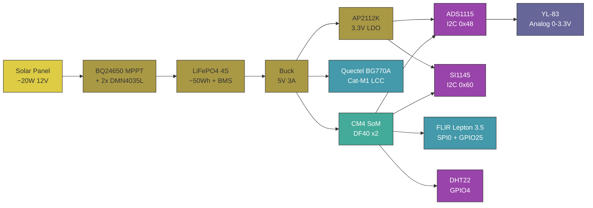
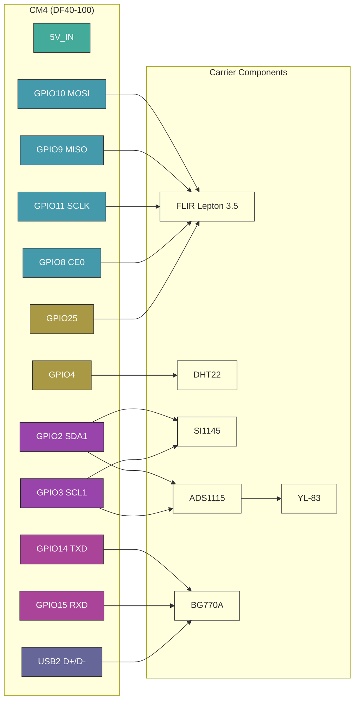

# DLR RTU PCB 🌡️⚡


> Single-PCB CM4 carrier for a solar-powered, cellular-connected RTU — mounts to a transmission tower cross-arm, integrates SoM + cellular modem + IEEE 738 sensor suite + solar/LiFePO4 power management. Feeds [`dlr-operating-envelope`](https://gitlab.com/arcnode-io/dlr-operating-envelope).

Solar-powered remote terminal unit (RTU) deployed unattended on transmission tower cross-arms. A ~20W solar panel and ~50Wh LiFePO4 battery keep the CM4 running indefinitely with cellular PSM idle. A soldered Quectel BG770A (LTE Cat-M1) publishes sensor data and dynamic ratings to the MQTT broker — no site WiFi or wired backhaul required. The unit is designed for 30-year conductor-adjacent deployment with no scheduled maintenance.

~100x80mm 4-layer industrial carrier. Raspberry Pi CM4 (DF40 dual-connector) + Quectel BG770A LCC + FLIR Lepton 3.5 (SPI) + DHT22 (GPIO) + SI1145 (I2C) + YL-83 (analog via ADS1115). MPPT charger from PV input, LiFePO4 BMS, buck for 5V SoM rail, AP2112K LDO for 3.3V analog front-end. Conformal coated, IP55 when potted in field enclosure.

## System Context

```plantuml
rectangle transmission_tower {
  rectangle field_enclosure {
    rectangle dlr_carrier {
      rectangle cm4_som
      rectangle cellular_module
      rectangle sensors
      rectangle power_mgmt
    }
  }
  rectangle solar_panel
  rectangle lifepo4_battery
  rectangle conductor
}

queue mqtt_broker
rectangle dlr_pst_sim

solar_panel -d- power_mgmt: PV input
power_mgmt -l- lifepo4_battery: charge / discharge
power_mgmt -d- cm4_som: 5V / 3V3
conductor -u- sensors: thermal view\n(FLIR Lepton)
sensors -r- cm4_som: SPI / I2C / GPIO
cm4_som -r- cellular_module: UART + USB2
cellular_module -r- mqtt_broker: LTE Cat-M1
mqtt_broker -r- dlr_pst_sim: tap \n adjustment \n commands
```

The carrier is the physical sensing + edge-compute layer of the DLR feedback loop. Every measurement flows through the IEEE 738 calculation in [`dlr-operating-envelope`](https://gitlab.com/arcnode-io/dlr-operating-envelope) and ultimately determines whether the phase shift transformer adjusts its tap position.

## Board Spec



## CM4 Pinout



## Sensor Interfaces

| Sensor | Interface | CM4 Pins | Sample Rate | Measurement | Feeds IEEE 738 Variable |
|--------|-----------|----------|-------------|-------------|------------------------|
| FLIR Lepton 3.5 | SPI0 + VSYNC | GPIO 8, 9, 10, 11, 25 | 8.6 Hz (frame) | Conductor surface temp | $R_{thermal}$ |
| DHT22 | GPIO4 (1-Wire) | GPIO 4 | 0.5 Hz | Ambient temp + humidity | $T_{amb}$ |
| SI1145 | I2C (0x60) | GPIO 2, 3 | 10 Hz | UV / Visible / IR irradiance | $\Delta T_{solar}$ |
| YL-83 → ADS1115 | I2C (0x48) ch0 | GPIO 2, 3 | 860 SPS | Rain intensity (0–3.3V analog) | $\Delta T_{rain}$ |

Every sensor reading on this board maps to exactly one term in the IEEE 738 dynamic rating equation:

$$ I_{max} = \sqrt{\frac{q_c + q_r - q_s}{R_{ac}}} $$

## Anemometer Variants

Single PCB + single firmware binary. Variant lives in the **kit BOM** — sensor,
cable harness, PV panel, and battery differ per SKU. Both sensors speak
NMEA 0183 (`$..MWV`) over RS-485, so the firmware driver is talker-agnostic.

### Kit BOM

| Component | High-wind kit (`DLR-CRN-HW`) | Low-wind kit (`DLR-CRN-LW`) |
|-----------|------------------------------|------------------------------|
| PCB | `dlr-rtu-pcb-v1` (same) | `dlr-rtu-pcb-v1` (same) |
| Firmware | `dlr-operating-envelope` (same binary) | `dlr-operating-envelope` (same binary) |
| Sensor | Calypso ULP STD | Vaisala WMT702 |
| Sensor wire protocol | NMEA `$IIMWV` over RS-485 | NMEA `$WIMWV` over RS-485 |
| Sensor accuracy (V<2 m/s) | ±5 % + 0.2 m/s offset (1 m/s threshold) | **±0.1 m/s** (0.01 m/s threshold) |
| Sensor op temp | unspecified (consumer-grade) | -10 to +60 °C |
| Cable harness | 5 m bare-wire to M12-5P | 5 m Cannon Trident 19-way to M12-5P |
| PV panel | 20 W | **30 W** |
| Battery | 50 Wh LiFePO4 | **100 Wh LiFePO4** |
| Sticker | `HW-1.0` | `LW-1.0` |
| Kit cost (approx) | ~$650 | ~$2350 |

### When to deploy which variant

Per-site SKU pick uses NREL WIND Toolkit climatology (or customer SCADA wx
history when available). Threshold: fraction-of-year with V_w < 1 m/s
perpendicular to conductor.

| Climatology | Variant | Why |
|---|---|---|
| ≤ 15 % yr V_w < 1 m/s (ridge / coastal / open plain w/ mean ≥ 6 m/s) | high-wind | uplift slice below 1 m/s is marginal; static fallback below threshold is fine |
| > 15 % yr V_w < 1 m/s (valley / sheltered / open plain w/ mean ≤ 5 m/s) | low-wind | uplift slice is material; pay $1.7 k premium to capture it |

### Fallback policy (both variants)

When the sensor reports `void` status, times out, or has a checksum/parse
error, the driver returns `None`. The IEEE 738 layer collapses None →
`V_w = 0.0` → natural-convection-only ampacity = the conductor's static
rating. Same conservative fallback used for the icing-fallback policy.

### Variant power budget

| | High-wind | Low-wind |
|---|---|---|
| Sensor continuous draw | 1 mW | 480 mW |
| System daily energy | 29.1 Wh | 40.6 Wh |
| Winter PV harvest (worst) | 45 Wh | 67.5 Wh |
| Winter margin | 1.55× | **1.66×** |
| Battery autonomy at 0 PV | 1.58 d | **2.22 d** |

Low-wind variant's 30 W / 100 Wh upgrade absorbs the WMT702's higher draw and
restores both winter margin and 2-day autonomy.

## Power Budget

| Rail | Source | Consumer | Idle (PSM) | Typical | Peak |
|------|--------|----------|------------|---------|------|
| 5V | Buck | CM4 | 80 mA | 1400 mA | 3000 mA (boot) |
| 5V | Buck | Quectel BG770A | <1 mA | 100 mA | 250 mA (TX) |
| 5V | Buck | FLIR Lepton 3.5 | 150 mA | 150 mA | 650 mA (shutter) |
| 5V | Buck | DHT22 | 1.5 mA | 1.5 mA | 2.5 mA |
| 3.3V | AP2112K LDO | ADS1115 + SI1145 + YL-83 | 9 mA | 9 mA | 14 mA |
| | | **Total @ 5V equiv** | **240 mA** | **1660 mA** | **3920 mA** |

The 3920 mA peak is a worst-case *sum*, not a supported operating point. The LMR33630 delivers 3.375 A with worst-case silicon, so a coincident CM4-boot + Lepton-shutter + modem-TX peak browns the rail out below the CM4's 4.75 V floor — firmware sequences those loads apart (**ADR-017**, derived in `theory.ipynb` §7 and asserted in `sim/test_spice.py`). The CM4 boot peak on its own holds the rail at ~4.95 V.

Daily energy with CM4-always-on idle + 1/min sensor wake + 1/15 min cellular TX: **~29 Wh/day** (derived in `theory.ipynb`). A 50 Wh battery (90% DoD) gives ~1.6 days autonomy with no PV. A 20W panel at 2.5 sun-hours/day (winter Northeast US worst case) delivers ~45 Wh/day after MPPT η — **1.55x winter margin**, 2.5x annual avg.

That margin assumes a 120 mA CM4 idle (tuned Pi OS Lite, headless). The CM4 datasheet §5.3 quotes ~400 mA typical idle; at that figure the budget is 62.6 Wh/day and the 20 W panel does **not** carry winter (0.72x). Idle current is the single measurement that most needs a bench check before committing to the panel size.

## Environmental

| Parameter | Spec | Notes |
|-----------|------|-------|
| Operating temp | -20°C to +85°C | CM4 commercial spec; cold-start heater required below -20°C |
| Conformal coat | Dow Corning 1-2577 | Applied post-assembly, mask connectors |
| Enclosure rating | IP55 (with field enclosure) | Board alone is not rated |
| Vibration | IEC 60068-2-6 (5–500 Hz, 2g) | Transmission tower wind loading |
| Expected service life | 30 years | Matches conductor replacement cycle |
| MTBF | >200,000 hours | Derated per MIL-HDBK-217F |
| Mounting | M3 standoffs, 4-corner | Single rigid PCB — no stack |

## Fabrication Pipeline

Fully scripted — no GUI step. KiCad's "Update PCB from Schematic" is GUI-only, so `cad/drawing/sync_pcb.py` does the same job from the SKiDL netlist: it rebuilds every footprint from the library and reassigns every pad net, which is what keeps the board honest about what the schematic says.

```
 1. uv run poe notebook         → theory.ipynb: power, signal integrity, 5V transients
 2. uv run poe build            → SKiDL netlist
 3. uv run poe schematic        → hierarchical .kicad_sch (one sheet per block)
 4. uv run poe validate-model   → ERC, 0 violations (exits non-zero otherwise)
 5. uv run poe sim / cover      → pytest: hand calcs + ngspice transients

 6. uv run poe layout-asm       → the whole board flow, in order:
      build       netlist from SKiDL
      sync-asm    footprints + pad nets  <- replaces the GUI "Update PCB from Schematic"
      place-asm   positions from cad/pcb_placement.yaml
      setup-asm   4-layer stack, design rules, net classes, GND + 5V planes
      fanout-asm  escape vias for the 0.4 mm connector, assigned before routing
      route-asm   Specctra DSN -> Freerouting -> SES import -> zone fill
      stitch-asm  vias from surface pads to their plane
      validate-asm DRC, 0 violations

    ┌──────────────────────────────────────────────────────┐
    │  HUMAN: review the render, adjust pcb_placement.yaml │
    └──────────────────────────────────────────────────────┘

 7. uv run poe generate-asm     → gerbers + drill + STEP + BOM + CPL
```

### Board status

ERC is 0. DRC is clean of clearance, short, annular-ring, hole and courtyard errors —
what is left is 7 silkscreen-overlap warnings and **2 open connections** out of 457
pads, both of them ground pins on J5 (Hirose DF40, 0.4 mm pitch):

| Net | Pad | At (mm) |
|---|---|---|
| GND | J5.20 | 197.80, 94.46 |
| GND | J5.25 | 199.00, 97.54 |

Both are redundant pins — the CM4 bonds its grounds internally — so what is missing is
return-path quality at that corner of the connector, not a broken net. It is still a
DRC error, so the gerbers in `output/` stay a preview until it closes.

**Why they are open.** It is a fanout-capacity limit, not a search failure. A row of
0.6 mm escape vias needs 0.75 mm centre to centre, so on a 0.4 mm pad pitch only every
other pin gets a via in the first row. The pins that miss out have to reach a second,
deeper row — but two 0.6 mm vias 0.75 mm apart leave a 0.15 mm slot, and a 0.2 mm trace
with 0.15 mm clearance needs 0.5 mm. **Once the first row is populated the second row is
unreachable.** Via rows have to be assigned before any routing happens; a router that
picks the nearest free site per pin always finishes one slot short.

`cad/drawing/fanout.py` does that assignment: it clears the connector's fanout band and
alternates along each pad row, one pin into the inter-row gap, the next out the back, so
same-side vias land 0.8 mm apart. It places all 39 escapes on J5 with zero clearance,
short or drill violations — the geometry works.

What is *not* done is the rebuild. Run on a board that is already routed, the pass has
to clear 223 tracks and vias to own its band, and `escape_pins` rebuilds only 23 of the
35 connections that leaves open — a net regression against the 2 here. Its place is
before Freerouting, where a full-strength router does the reconnection, which is where
`poe layout-asm` now calls it. **That path has not been run end to end yet**, so the
board in this repo is still the pre-fanout one. Closing the last two means either that
full regeneration, or 0.45 / 0.25 mm vias (JLCPCB advanced tier, and the 0.13 mm
annular-ring rule would have to come down with them), or six layers.

### Toolchain

**KiCad 10 required.** The board is KiCad 10 format (`20260206`); on KiCad 9
`poe validate-asm` says DRC could not run rather than passing silently. The CI
runner gets 10.x from Flatpak. The schematic is format `20250114`, which both
versions read.

ERC is a blocking gate in CI. DRC runs and reports but does not gate yet — the two
open ground pins above are real errors; the `|| echo` comes off once they are closed.

## Layer Stack

4-layer, 1.6 mm FR4, controlled impedance (ADR-016). Applied by `cad/drawing/board_setup.py`, so a regenerated board always has the same stack.

| Layer | Use |
|-------|-----|
| F.Cu | Signal — high-speed (SPI 20MHz, USB2.0 to BG770A) |
| In1.Cu | GND plane, unbroken (reference for the USB pair and the Lepton SPI) |
| In2.Cu | 5V_RAIL plane — CM4, both LDOs and the Lepton feed off it via drops |
| B.Cu | Signal — low-speed (I2C, GPIO, UART) |

Signals are confined to F.Cu / B.Cu: the router is told the inner layers are `power` type, so nothing slices a plane. VBAT, 3V3 and 3V8 run as 0.6 mm traces (`power` net class), necked to 0.25/0.2 mm where an escape has to squeeze past a 0.4 mm-pitch pad. Every via is 0.6/0.3 mm: a 0.5/0.25 mm via would ease the DF40 fanout but leaves a 0.125 mm annular ring, under the 0.13 mm rule.

Unbroken ground plane under the Lepton is critical — SPI runs at 20 MHz and the thermal imager is noise-sensitive. USB2.0 to the BG770A is differential-routed at 90Ω matched impedance with GND directly below. Analog traces from YL-83 to ADS1115 are guard-ringed on F.Cu. Cellular antenna is 50Ω microstrip to a u.FL connector.

## Project Structure

```
├── pyproject.toml              # Dependencies and build config
├── theory.ipynb                # Power, signal integrity, 5V transient derivations
├── sim/
│   ├── constants.py            # Sourced part parameters (datasheet + edition cited)
│   ├── model.py                # Closed-form: buck current, energy, I2C/SPI/USB
│   ├── spice_bank.py           # Shared 5V output capacitor bank
│   ├── spice_ripple.py         # ngspice: open-loop switching ripple (Eq 7)
│   ├── spice_load_step.py      # ngspice: averaged current-mode boot-peak droop
│   ├── test_run.py             # Assert closed-form results match theory.ipynb
│   └── test_spice.py           # Assert ngspice results match theory.ipynb §7
├── cad/
│   ├── netlist/
│   │   ├── model.py            # Top-level SKiDL circuit (main carrier)
│   │   ├── charger.py          # Solar input + BQ24650 MPPT charger (ADR-015)
│   │   ├── power.py            # LMR33630 5V buck + AP2112K / LP5907 LDOs
│   │   ├── som.py              # CM4 DF40 connector + decoupling
│   │   ├── cellular.py         # BG770A + SIM holder + u.FL
│   │   ├── sensors.py          # FLIR (FFC), DHT22, SI1145, ADS1115, YL-83
│   │   ├── anemometer.py       # RS-485 wind sensor port (SKU-agnostic)
│   │   ├── connectors.py       # Battery + debug + USB-C commissioning
│   │   └── lepton_daughter.py  # Daughterboard SKiDL (Molex socket + FFC)
│   ├── schematic/              # Hierarchical .kicad_sch generator
│   │   ├── schematic.py        # Netlist parse, block classification, placement
│   │   ├── multi_sheet.py      # Per-block child sheets, power symbols, PWR_FLAG
│   │   ├── root_sheet.py       # Root sheet + cross-net sheet pins
│   │   └── sch_guard.py        # Fails the build on cross-net wire/pin collisions
│   ├── drawing/                # Board pipeline (system python3 — pcbnew)
│   │   ├── sync_pcb.py         # Footprints + pad nets from the netlist
│   │   ├── place_pcb.py        # Positions from pcb_placement.yaml
│   │   ├── board_setup.py      # 4-layer stack, rules, net classes, planes
│   │   ├── route_pcb.py        # DSN -> Freerouting -> SES -> fill
│   │   ├── fanout.py           # Pre-assigned escape vias for fine-pitch connectors
│   │   ├── stitch_planes.py    # Surface-pad vias into the planes
│   │   ├── close_gaps.py       # L-shaped hops across the autorouter's leftovers
│   │   ├── maze_grid.py        # Grid window shared by the escape router
│   │   ├── maze_field.py       # Analytic clearance fields (foreign copper only)
│   │   ├── maze_search.py      # Grid A*, 8-way, with via layer changes
│   │   ├── maze_escape.py      # Route + verify one connection, or tear it out again
│   │   ├── escape_pins.py      # Drives the escape router off the DRC report
│   │   ├── rip_targets.py      # Finds a stranded pin's blockers; performs the rip
│   │   └── rip_up.py           # Rip / re-route / keep-only-if-better loop
│   ├── lepton_daughter/        # Second PCB (per ADR-013) — Lepton + bracket
│   ├── assembly/               # CadQuery → GLB pipeline (build_assembly.py)
│   ├── layout_spec.yaml        # Schematic block layout
│   ├── pcb_placement.yaml      # Main-PCB component positions
│   └── drawing-sheet.kicad_wks # Title block
├── output/
│   ├── drawings/               # Schematic SVG + PDF
│   ├── gerbers/                # Fabrication files
│   └── fab/                    # BOM + CPL for assembly
└── readme.md                   # This file
```
